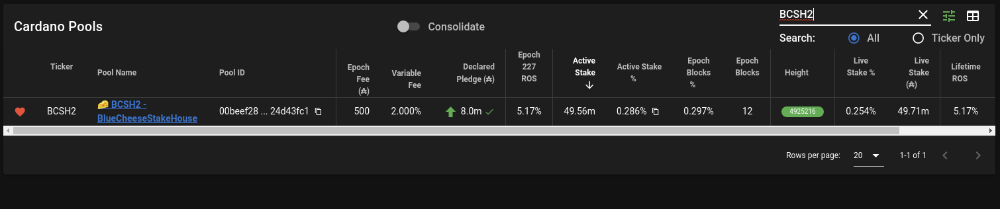

Sendtip command
===============================================================================

The sendtip command is used to communicate with pooltool.io so you can have a 
green badge on their website with your current tip height. pooltool tip image

It is important to point this command at your core nodes. This will help pooltool 
capture any orphan blocks. There is no guarantee that an orphan block you make 
will be seen by pooltool. Pointing to your core nodes should help with that.

Configuring pooltool.json
-------------------------------------------------------------------------------

You need to create a pooltool.json file so that the sendtip command knows what 
node(s) to connect to. It also contains your pooltool configuration. Your pooltool 
api key can be found on your pooltool profile page.

.. literalinclude:: assets/pooltool.json
   :language: bash
   :caption: Pooltool configuration file
   :name: cncli:assets/pooltool.json

Sending tips to pooltool
-------------------------------------------------------------------------------

.. code-block:: bash

  $ docker run --interactive \
     coincodile/cardano-cncli:latest \
     sendtip \
         --cardano-node /home/westbam/.local/bin/cardano-node \
         --config pooltool.json
 
 

